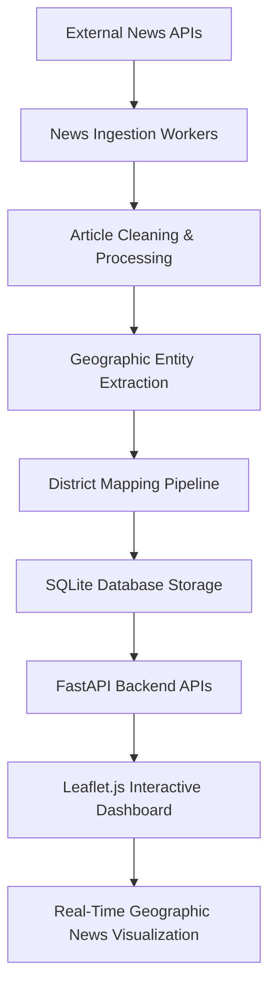

# Nepal News Map Intelligence Platform

An AI-powered bilingual news intelligence platform that aggregates, processes, and geographically visualizes breaking news across all 77 districts of Nepal.

The platform combines real-time news ingestion, geographic intelligence extraction, and interactive mapping to transform unstructured news articles into district-level visual insights. By integrating multilingual data pipelines with location-aware processing, the system provides a live overview of regional events happening throughout Nepal.

## Project Objectives
- Aggregate news from multiple English and Nepali news sources
- Extract district-level geographic context from unstructured articles
- Visualize real-time news density geographically
- Build a scalable news intelligence and monitoring system
- Demonstrate practical applications of NLP and geographic data systems

## Key Features

### Bilingual News Aggregation
The platform ingests news content in:
- **English**
- **Nepali** (Devanagari script)
Using multiple external news APIs.

### Geographic News Intelligence
A custom district-tagging pipeline identifies geographic references inside article titles and descriptions, allowing the platform to:
- Associate news with districts
- Categorize local events geographically
- Filter irrelevant locations

### Interactive Nepal Intelligence Map
Built using **Leaflet.js**, the platform provides:
- District-level choropleth visualization
- Interactive district highlighting
- Live district news density mapping
- District-specific news drawers
- Hotspot detection for trending regions

### Real-Time Data Processing
The backend continuously ingests and processes news articles using asynchronous workers powered by:
- **FastAPI**
- **HTTPX**
- **Async database operations**

### Administrative Dashboard
The project includes an admin monitoring interface for:
- Ingestion management
- API monitoring
- District coverage tracking
- System health inspection

---

## Why This Project Was Built
Modern news ecosystems generate massive volumes of information every minute. However, local and regional stories often become difficult to track systematically, especially in geographically diverse countries like Nepal.

This project was built to explore how **Natural Language Processing**, **Geographic Intelligence**, **Real-Time Data Pipelines**, and **Interactive Visualization** can be combined to create a localized news intelligence system.

Instead of simply displaying articles, the platform transforms news data into geographic insights that help users understand where events are occurring and how information is distributed across the country.

---

## System Architecture


---

## Tech Stack

### Frontend
- **HTML5 & Semantic UI**
- **Vanilla JavaScript (ES6+)**
- **CSS3 (Custom Design System)**
- **Leaflet.js** (Mapping Engine)

### Backend
- **FastAPI** (High-performance Python Framework)
- **Python 3.10+**
- **HTTPX** (Async HTTP Client)
- **SQLAlchemy** (ORM)

### Database
- **SQLite** (Asynchronous via `aiosqlite`)

### NLP & Processing
- **Custom Geographic Named Entity Recognition (NER)**
- **Regex-based district tagging pipeline**

### External APIs
- **NewsData.io**
- **World News API**

---

## Data Processing Pipeline
The platform follows this workflow:
1. **Fetch**: News articles from external APIs.
2. **Normalize**: Clean and structure article metadata.
3. **Extract**: Identify district-level geographic references.
4. **Map**: Associate articles with specific Nepal districts.
5. **Store**: Persist processed data in the database.
6. **Serve**: Provide district intelligence through FastAPI.
7. **Visualize**: Render results on the interactive dashboard.

---

## Geographic Intelligence Engine
The project includes a custom district-level Named Entity Recognition pipeline designed specifically for Nepal.

The system:
- Detects English and Nepali district names
- Filters ambiguous locations
- Maps articles geographically
- Supports multilingual article processing

---

## Project Structure
```text
Nepal-News-Map-Intelligence-Platform/
│
├── backend/
│   ├── main.py              # FastAPI Application Entry
│   ├── db.py                # Database Configuration
│   ├── models/              # Database Models
│   └── seed_districts.py    # Database Seeding Script
│
├── frontend/
│   ├── index.html           # Main Map Dashboard
│   ├── admin.html           # Admin Monitoring Panel
│   ├── css/                 # Styling Assets
│   └── js/                  # Frontend Logic
│
├── scraper/
│   ├── ingest_worker.py     # Main Ingestion Worker
│   ├── deep_ingest.py       # District-specific Deep Scraper
│   ├── newsdata_client.py   # NewsData API Integration
│   ├── worldnews_client.py  # World News API Integration
│   └── pipeline/            # Processing Logic
│
├── requirements.txt         # Project Dependencies
├── README.md                # Project Documentation
└── .env                     # Environment Variables
```

---

## Installation & Setup

### Prerequisites
- Python 3.10+
- pip
- API keys for **NewsData.io** and **World News API**

### Backend Setup
1. **Clone the repository:**
   ```bash
   git clone https://github.com/Alpha107/Nepal-News-Map-Intelligence-Platform.git
   cd Nepal-News-Map-Intelligence-Platform
   ```

2. **Create a virtual environment:**
   - **Windows:**
     ```powershell
     python -m venv venv
     .\venv\Scripts\activate
     ```
   - **Linux/macOS:**
     ```bash
     python3 -m venv venv
     source venv/bin/activate
     ```

3. **Install dependencies:**
   ```bash
   pip install -r requirements.txt
   ```

### Environment Configuration
Create a `.env` file in the root directory:
```env
NEWSDATA_API_KEY=your_newsdata_key
WORLDNEWS_API_KEY=your_worldnews_key
DATABASE_URL=sqlite+aiosqlite:///./nepal_news.db
```

### Initialize Database
Seed Nepal district data:
```bash
python -m backend.seed_districts
```

---

## Run Development Server
```bash
python -m uvicorn backend.main:app --host 0.0.0.0 --port 8000 --reload
```
- **Application Dashboard:** [http://localhost:8000](http://localhost:8000)
- **Admin Dashboard:** [http://localhost:8000/admin](http://localhost:8000/admin)

### Run News Ingestion Workers
- **Standard Ingestion:** `python -m scraper.ingest_worker`
- **Deep District Ingestion:** `python -m scraper.deep_ingest`

---

## Screenshots

### Interactive Nepal News Map


### District Spotlight View


### Trending District Visualization


### Admin Dashboard


---

## Potential Applications
- Real-time regional news monitoring
- Disaster intelligence systems
- Public information dashboards
- Government analytics platforms
- Media monitoring systems
- Geographic event tracking
- Research and educational demonstrations

---

## Current Limitations
- Current NER pipeline is rule-based.
- News accuracy depends on external APIs.
- Limited semantic understanding of article context.
- SQLite may become inefficient under high-scale workloads.
- No user authentication system yet.

## Future Improvements
- **Transformer-based NLP models** (BERT/RoBERTa for Nepali)
- **Nepali-language semantic analysis**
- **PostgreSQL migration** for production scaling
- **Redis caching layer**
- **Docker containerization**
- **AI-based event classification**
- **Sentiment analysis integration**
- **Historical analytics and trend forecasting**

## Scalability Roadmap
- Celery-based ingestion workers
- Redis task queues
- Full cloud deployment (AWS/GCP)
- Containerized infrastructure
- Distributed API ingestion

---

## Contributing
Contributions and improvements are welcome.
1. Fork the repository.
2. Create a feature branch.
3. Commit changes.
4. Open a pull request.

## License
This project is intended for educational, research, and portfolio purposes.
News data is provided by **NewsData.io** and **World News API**.

## Author
**Abashesh Ranabhat**
*Computer Engineer | AI & Robotics Enthusiast | ML Practitioner*

- **GitHub:** [Alpha107](https://github.com/Alpha107)
- **LinkedIn:** [Abashesh Ranabhat](https://www.linkedin.com/in/abashesh-ranabhat/)

---

### Final Note
**Nepal News Map Intelligence Platform** demonstrates the integration of Natural Language Processing, Geographic Intelligence, Asynchronous Data Systems, and Interactive Visualization to create a real-time district-level news intelligence system tailored for Nepal.
